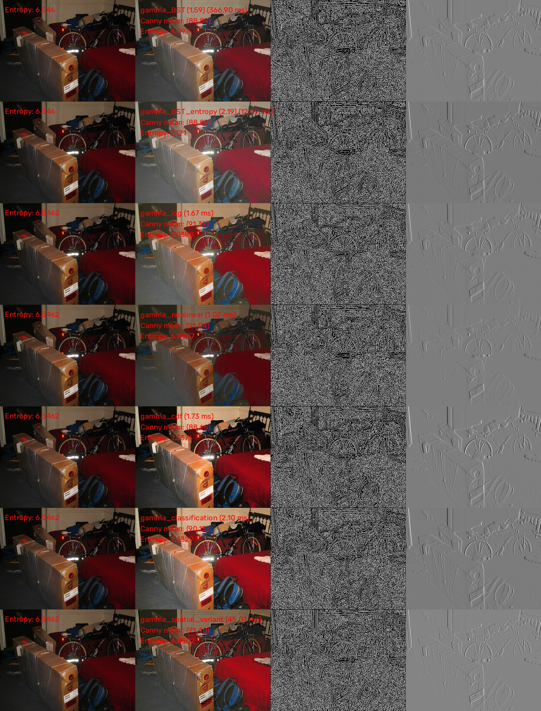
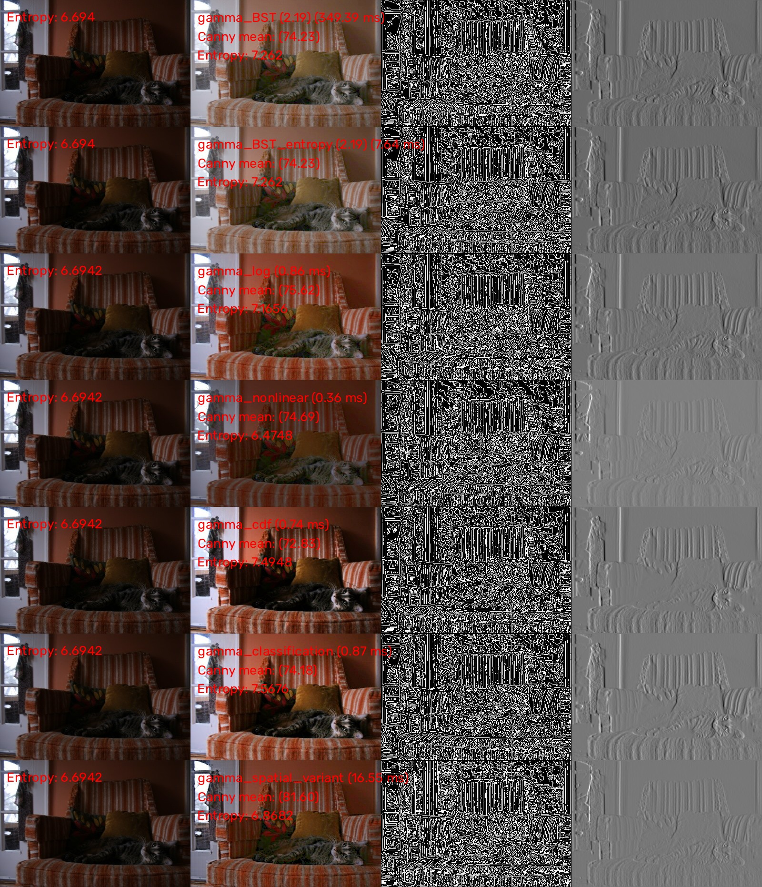
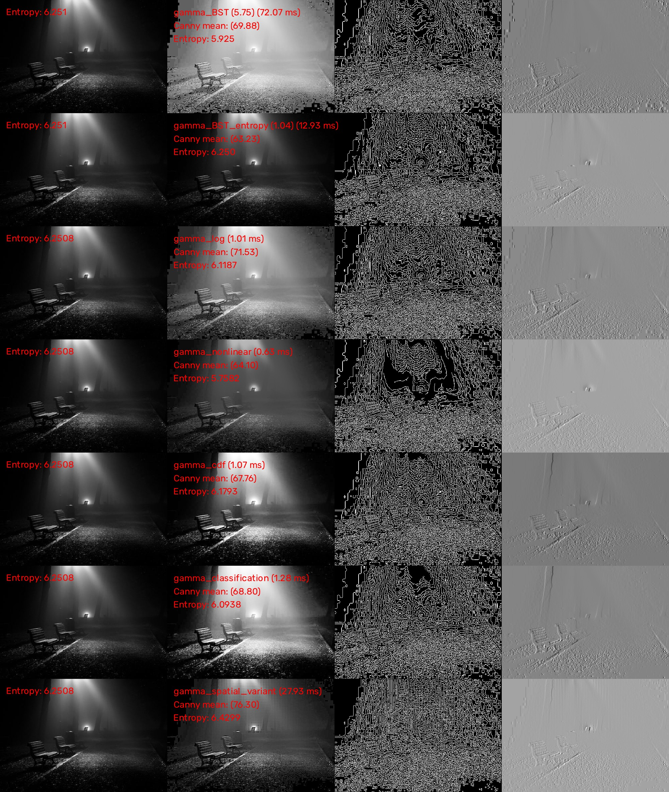
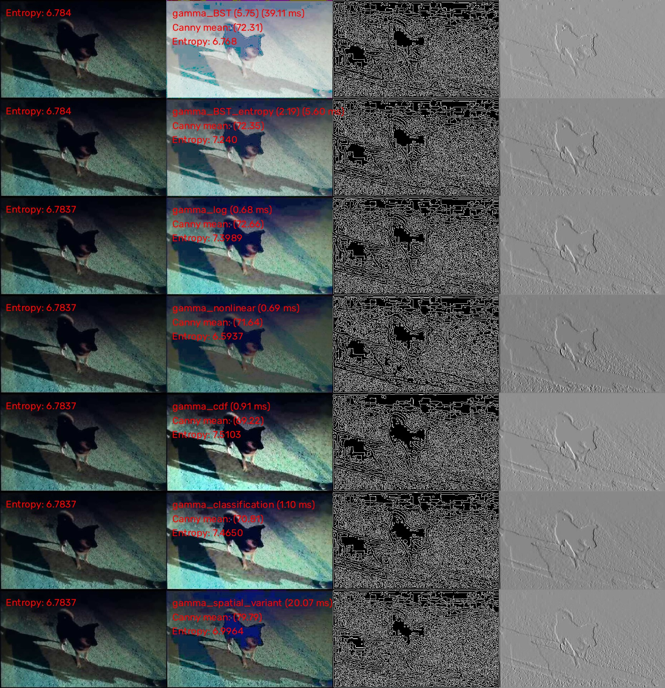
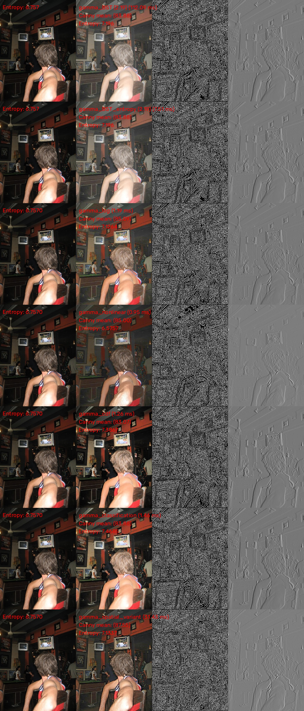

# Automatic Gamma correction (image brightness adjustment)

## The correct way

### References

#### Gamma correction
- [J. Scott, & Michael A. Pusateri (2009). Towards real-time hardware gamma correction for dynamic contrast enhancement. 2009 IEEE Applied Imagery Pattern Recognition Workshop (AIPR 2009), 1-5.](https://vision.cse.psu.edu/publications/pdfs/scott_2009_gamma.pdf)
- [Yihua Shi, Jinfeng Yang, & Renbiao Wu (2007). Reducing Illumination Based on Nonlinear Gamma Correction. 2007 IEEE International Conference on Image Processing, 1, I - 529-I - 532.](https://projet.liris.cnrs.fr/imagine/pub/proceedings/ICIP-2007/pdfs/0100529.pdf)
- [Shih-Chia Huang, Fan-Chieh Cheng, & Yi-Sheng Chiu (2013). Efficient Contrast Enhancement Using Adaptive Gamma Correction With Weighting Distribution. IEEE Transactions on Image Processing, 22, 1032-1041.](https://www.matlabi.ir/wp-content/uploads/bank_papers/ipaper/i53_www.Matlabi.ir_Efficient%20Contrast%20Enhancement%20Using%20Adaptive%20Gamma%20Correction%20With%20Weighting%20Distribution.pdf)
- [Shanto Rahman, Mostafijur Rahman, Mohammad Abdullah-Al-Wadud, Golam Dastegir Al-Quaderi, & Mohammad Shoyaib (2016). An adaptive gamma correction for image enhancement. EURASIP Journal on Image and Video Processing, 2016, 1-13.](https://jivp-eurasipjournals.springeropen.com/counter/pdf/10.1186/s13640-016-0138-1.pdf)
- [Sungmok Lee, Homin Kwon, Hagyong Han, Gidong Lee, & Bongsoon Kang (2010). A Space-Variant Luminance Map based Color Image Enhancement. IEEE Transactions on Consumer Electronics, 56.](https://ieeexplore.ieee.org/document/5681151)

#### Image Contrast Enhancement
- [dengyueyun666/Image-Contrast-Enhancement (C++)](https://github.com/dengyueyun666/Image-Contrast-Enhancement) (multiple implementations (12))
- [AndyHuang1995/Image-Contrast-Enhancement (Python)](https://github.com/AndyHuang1995/Image-Contrast-Enhancement) (Python implementation of [Zhenqiang Ying, Ge Li, Yurui Ren, Ronggang Wang, & Wenmin Wang (2017). A New Image Contrast Enhancement Algorithm Using Exposure Fusion Framework. In International Conference on Computer Analysis of Images and Patterns.](https://baidut.github.io/OpenCE/caip2017.html))
- [Gang Cao, Lihui Huang, Huawei Tian, Xianglin Huang, Yongbin Wang, & Ruicong Zhi. (2022). Contrast Enhancement of Brightness-Distorted Images by Improved Adaptive Gamma Correction.](https://arxiv.org/abs/1709.04427) ([leowang7/iagcwd](https://github.com/leowang7/iagcwd))

## The dumb way

### Binary search tree
- [wiki](https://en.wikipedia.org/wiki/Binary_search_tree)

A very rough code should give something like this:

<details>
<summary>C++</summary>

```c++
#include <iostream>
#include <vector>

namespace
{
void getBSTvalues(std::vector<double> &gamma_vec, double midpoint, double range, int level, int max_levels)
{
  if (level < max_levels) {
    double gamma_left = midpoint - range/2;
    getBSTvalues(gamma_vec, gamma_left, range/2, level+1, max_levels);

    gamma_vec.push_back(midpoint);

    double gamma_right = midpoint + range/2;
    getBSTvalues(gamma_vec, gamma_right, range/2, level+1, max_levels);
  }
  else {
    double gamma_left = midpoint - range/2;
    gamma_vec.push_back(gamma_left);
    gamma_vec.push_back(midpoint);
    double gamma_right = midpoint + range/2;
    gamma_vec.push_back(gamma_right);
  }
}
} // namespace

int main(int, const char *[])
{
  int max_levels = 4;
  double min_val = 0, max_val = 2;
  double range = (max_val - min_val) / 2.0;
  double midpoint = min_val + range;

  for (int level = 0; level < max_levels; level++) {
    std::cout << "\nLevel: " << level << std::endl;
    if (level == 0) {
      std::cout << midpoint;
    }
    else {
      int level_start = 1;
      std::vector<double> gamma_vec;
      getBSTvalues(gamma_vec, midpoint, range, level_start, level);
      for (auto gamma_val : gamma_vec) {
        std::cout << gamma_val << " ";
      }
    }
    std::cout << std::endl;
  }

  return EXIT_SUCCESS;
}
```

</details>

- Output (range is [0 - 2]):

```bash
Level: 0
1

Level: 1
0.5 1 1.5

Level: 2
0.25 0.5 0.75 1 1.25 1.5 1.75

Level: 3
0.125 0.25 0.375 0.5 0.625 0.75 0.875 1 1.125 1.25 1.375 1.5 1.625 1.75 1.875
```

### Compute the Gamma value to be used

#### Contour information (Canny)
The first idea was to use the mean Canny information to "guide" the recursive search in order to find a Gamma value that would "maximize" the number of contours in the image.

#### Image entropy
Image entropy is a whole topic but some available [C++ code](https://github.com/dengyueyun666/Image-Contrast-Enhancement/blob/cd2b1eb5bf6396e2fc3b94cd27f73933d5467147/src/Ying_2017_CAIP.cpp#L186-L207) can be directly used.

### Datasets
- [Exclusively Dark (ExDark) Image Dataset (Official Site)](https://github.com/cs-chan/Exclusively-Dark-Image-Dataset)
- [Awesome Low Light Image Enhancement](https://github.com/dawnlh/awesome-low-light-image-enhancement)
  - [LOw Light paired dataset (LOL)](https://daooshee.github.io/BMVC2018website/)
  - [Testing Images: Google Drive](https://drive.google.com/file/d/1OvHuzPBZRBMDWV5AKI-TtIxPCYY8EW70/view)
- [VIP-LowLight Dataset](https://uwaterloo.ca/vision-image-processing-lab/research-demos/vip-lowlight-dataset)

### Some results

#### ExDark











#### LoL_Test


#### vip-lowlight


#### Google Drive
- [More results](https://drive.google.com/drive/folders/12b9-799OLL3THbwFrCwQpT-KI7uzgmIx?usp=drive_link)