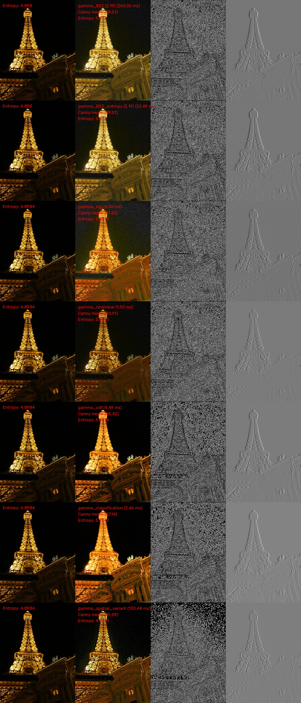

# Automatic Gamma correction (image brightness adjustment)

## The correct way

### References

#### Gamma correction
- [J. Scott, & Michael A. Pusateri (2009). Towards real-time hardware gamma correction for dynamic contrast enhancement. 2009 IEEE Applied Imagery Pattern Recognition Workshop (AIPR 2009), 1-5.](https://vision.cse.psu.edu/publications/pdfs/scott_2009_gamma.pdf)
- [Yihua Shi, Jinfeng Yang, & Renbiao Wu (2007). Reducing Illumination Based on Nonlinear Gamma Correction. 2007 IEEE International Conference on Image Processing, 1, I - 529-I - 532.](https://projet.liris.cnrs.fr/imagine/pub/proceedings/ICIP-2007/pdfs/0100529.pdf)
- [Shih-Chia Huang, Fan-Chieh Cheng, & Yi-Sheng Chiu (2013). Efficient Contrast Enhancement Using Adaptive Gamma Correction With Weighting Distribution. IEEE Transactions on Image Processing, 22, 1032-1041.](https://www.matlabi.ir/wp-content/uploads/bank_papers/ipaper/i53_www.Matlabi.ir_Efficient%20Contrast%20Enhancement%20Using%20Adaptive%20Gamma%20Correction%20With%20Weighting%20Distribution.pdf)
- [Shanto Rahman, Mostafijur Rahman, Mohammad Abdullah-Al-Wadud, Golam Dastegir Al-Quaderi, & Mohammad Shoyaib (2016). An adaptive gamma correction for image enhancement. EURASIP Journal on Image and Video Processing, 2016, 1-13.](https://jivp-eurasipjournals.springeropen.com/counter/pdf/10.1186/s13640-016-0138-1.pdf)
- [Sungmok Lee, Homin Kwon, Hagyong Han, Gidong Lee, & Bongsoon Kang (2010). A Space-Variant Luminance Map based Color Image Enhancement. IEEE Transactions on Consumer Electronics, 56.](https://ieeexplore.ieee.org/document/5681151)

#### Image Contrast Enhancement
- [dengyueyun666/Image-Contrast-Enhancement (C++)](https://github.com/dengyueyun666/Image-Contrast-Enhancement) (multiple implementations (12))
- [AndyHuang1995/Image-Contrast-Enhancement (Python)](https://github.com/AndyHuang1995/Image-Contrast-Enhancement) (Python implementation of [Zhenqiang Ying, Ge Li, Yurui Ren, Ronggang Wang, & Wenmin Wang (2017). A New Image Contrast Enhancement Algorithm Using Exposure Fusion Framework. In International Conference on Computer Analysis of Images and Patterns.](https://baidut.github.io/OpenCE/caip2017.html))
- [Gang Cao, Lihui Huang, Huawei Tian, Xianglin Huang, Yongbin Wang, & Ruicong Zhi. (2022). Contrast Enhancement of Brightness-Distorted Images by Improved Adaptive Gamma Correction.](https://arxiv.org/abs/1709.04427) ([leowang7/iagcwd](https://github.com/leowang7/iagcwd))

## Some experimentations

### Papers
- [Inwook Shim, Joon-Young Lee, & In-So Kweon (2014). Auto-adjusting camera exposure for outdoor robotics using gradient information. 2014 IEEE/RSJ International Conference on Intelligent Robots and Systems, 1011-1017.](https://joonyoung-cv.github.io/assets/paper/14_iros_auto_adjusting.pdf)
- [Inwook Shim, Tae-Hyun Oh, Joon-Young Lee, Jin Wook Choi, Dong-geol Choi, & In So Kweon (2017). Gradient-Based Camera Exposure Control for Outdoor Mobile Platforms. IEEE Transactions on Circuits and Systems for Video Technology, 29, 1569-1583.](https://arxiv.org/abs/1708.07338)
- [Zichao Zhang, Christian Forster, & Davide Scaramuzza (2017). Active exposure control for robust visual odometry in HDR environments. 2017 IEEE International Conference on Robotics and Automation (ICRA), 3894-3901.](https://www.ifi.uzh.ch/dam/jcr:cc5c71f1-3491-4c7e-9490-bb16278aa75e/ICRA17_Zhang_updated.pdf)
- [Ziang Ren, Samuel E. Lensgraf, & Alberto Quattrini Li (2024). Improving the perception of visual fiducial markers in the field using Adaptive Active Exposure Control. ArXiv, abs/2404.12055.](https://arxiv.org/abs/2404.12055)

### Camera Response Model
- [Zhenqiang Ying, Ge Li, Yurui Ren, Ronggang Wang, & Wenmin Wang (2017). A New Low-Light Image Enhancement Algorithm Using Camera Response Model. 2017 IEEE International Conference on Computer Vision Workshops (ICCVW), 3015-3022.](https://openaccess.thecvf.com/content_ICCV_2017_workshops/papers/w43/Ying_A_New_Low-Light_ICCV_2017_paper.pdf):
  - [Michael D. Grossberg, & Shree K. Nayar (2004). Modeling the space of camera response functions. IEEE Transactions on Pattern Analysis and Machine Intelligence, 26, 1272-1282.](https://cave.cs.columbia.edu/old/publications/pdfs/Grossberg_PAMI04.pdf)
  - [Steve Mann (2000). Comparametric equations with practical applications in quantigraphic image processing. IEEE transactions on image processing : a publication of the IEEE Signal Processing Society, 9 8, 1389-406.](http://wearcam.org/comparametrics.pdf)
  - [Modeling the Space of Camera Response FunctionsResponse Functions, School of Electrical Engineering and Computer Science KyungpookKyungpook National Univ.National Univ.](https://www.researchgate.net/profile/Michael-Grossberg/publication/3193780_Modeling_the_space_of_camera_response_functions/links/0deec5214cc89adc87000000/Modeling-the-space-of-camera-response-functions.pdf)
  - [Digital photography, 16-385 Computer Vision Spring 2018, Lecture 16](https://www.cs.cmu.edu/~16385/s18/lectures/lecture16.pdf)
- [Zhenqiang Ying, Ge Li, Yurui Ren, Ronggang Wang, & Wenmin Wang (2017). A New Image Contrast Enhancement Algorithm Using Exposure Fusion Framework. In International Conference on Computer Analysis of Images and Patterns.](https://www.researchgate.net/profile/Zhenqiang-Ying/publication/318730125_A_New_Image_Contrast_Enhancement_Algorithm_Using_Exposure_Fusion_Framework/links/59acef15458515d09cd8b8d0/A-New-Image-Contrast-Enhancement-Algorithm-Using-Exposure-Fusion-Framework.pdf)
- Using the entropy measure is stupid here since artificially applying a Gamma correction to an image does not make it more informative:

### Metrics
Some metrics have been displayed:
- Contour information (mean Canny)
- Image gradient
- [Image contrast](https://stackoverflow.com/questions/63437029/implementing-histogram-spread-for-image-contrast-metrics/63441306#63441306)
- Image entropy
- Lines detection (OpenCV Line Segment Detector)
- Shim metric (Shim IROS 2014)
- Zhang metric (Zhang ICRA 2017)

#### Examples on MEF dataset

### Datasets
- [Exclusively Dark (ExDark) Image Dataset (Official Site)](https://github.com/cs-chan/Exclusively-Dark-Image-Dataset)
- [Awesome Low Light Image Enhancement](https://github.com/dawnlh/awesome-low-light-image-enhancement)
  - [LOw Light paired dataset (LOL)](https://daooshee.github.io/BMVC2018website/)
  - [Testing Images: Google Drive](https://drive.google.com/file/d/1OvHuzPBZRBMDWV5AKI-TtIxPCYY8EW70/view)
- [VIP-LowLight Dataset](https://uwaterloo.ca/vision-image-processing-lab/research-demos/vip-lowlight-dataset)

### Some results

#### LoL_Test

#### vip-lowlight

