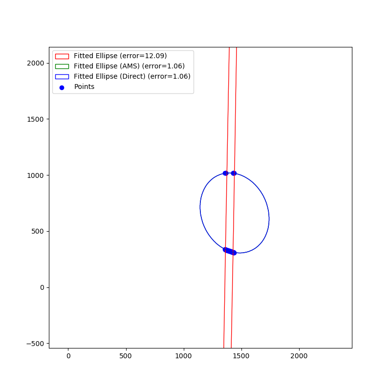
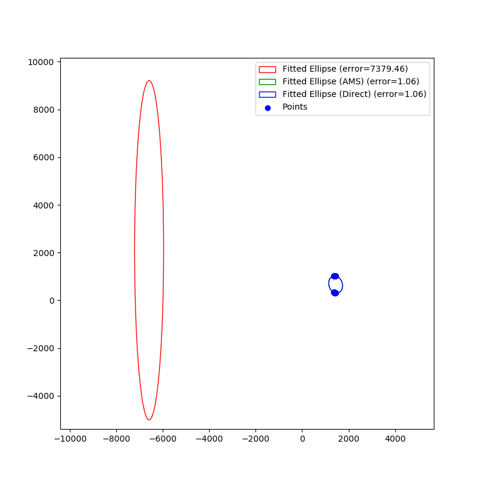

# Ellipse fitting error

## References

### OpenCV issue ticket
- [fitEllipse returns a very far ellipse #26078](https://github.com/opencv/opencv/issues/26078)

### Implementation details
- [distance from given point to given ellipse (SO)](https://stackoverflow.com/questions/22959698/distance-from-given-point-to-given-ellipse/46007540#46007540)
- credit to:
  - [Simple Method for Distance to Ellipse, Carl Chatfield](https://blog.chatfield.io/simple-method-for-distance-to-ellipse/)
  - [0xfaded/ellipse_demo](https://github.com/0xfaded/ellipse_demo)

## Results

### `cv.fitEllipse()`

### Modified `cv.fitEllipse()`

### `cv.fitEllipseAMS()` / `cv.fitEllipseDirect()`

### 2D plot: with and without first SVD decomposition

Without corresponds to this [line](https://github.com/opencv/opencv/blob/450e741f8d53ff12b4e194c7762adaefb952555a/modules/imgproc/src/shapedescr.cpp#L453) being commented:

Original code gives:

