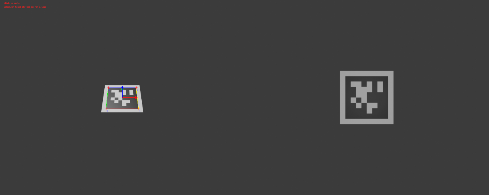
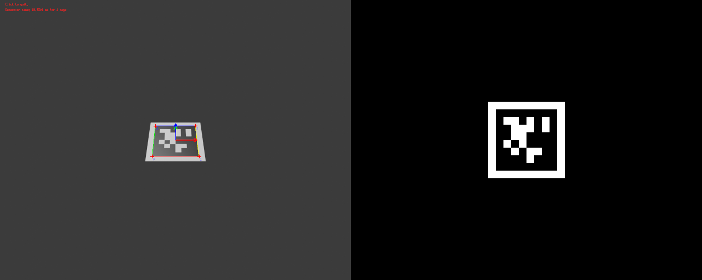

# Photometric pose refinement

## WARNING

Following are simply experimentations for learning purposes.

## References

- ["Visual servo control, Part I: Basic approaches",  François Chaumette, Seth Hutchinson](https://inria.hal.science/inria-00350283)
- ["Visual servo control, Part II: Advanced approaches",  François Chaumette, Seth Hutchinson](https://inria.hal.science/inria-00350638)
- ["Visual servoing set free from image processing", Christophe Collewet, Eric Marchand, François Chaumette](https://inria.hal.science/inria-00261398)
- ["Photometric visual servoing", Christophe Collewet, Eric Marchand](https://inria.hal.science/inria-00629834/document)
- ["Pose Estimation for Augmented Reality: A Hands-On Survey", Eric Marchand, Hideaki Uchiyama, Fabien Spindler](https://inria.hal.science/hal-01246370v1)
- ["An Invitation to 3-D Vision From Images to Models", "Chapter 3 - Image Formation"](https://cs.gmu.edu/%7Ekosecka/cs685/VisionBookHandout.pdf)

## Experimentations

### Photometric error between both Blender images
- Blender is used to render the camera image (left image with AprilTag pose detection in overlay)
- A spot light is used as illumination with some translation + orientation
- **Both** the input and reference images are generated from Blender

  <image src="both_Blender/img_detection_tag.png" width="960" height="384"/>

<!--  -->

  <video src="./both_Blender/I_error.mp4" width="640" height="512" type="video/mp4" controls/>

<video width="640" height="512" controls>
  <source src="./both_Blender/I_error.mp4" type="video/mp4">
</video>

### Photometric error between input Blender image and reference AprilTag image
- Blender is only used to render the camera image (left image with AprilTag pose detection in overlay)
- A spot light is used as illumination with some translation + orientation
- The reference tag image has been resized from default AprilTag marker id

  <image src="Blender_marker_code/img_detection_tag.png" width="960" height="384"/>

<!--  -->

  <video src="./Blender_marker_code/I_error.mp4" width="640" height="512" type="video/mp4" controls/>

<video width="640" height="512" controls>
  <source src="./Blender_marker_code/I_error.mp4" type="video/mp4">
</video>